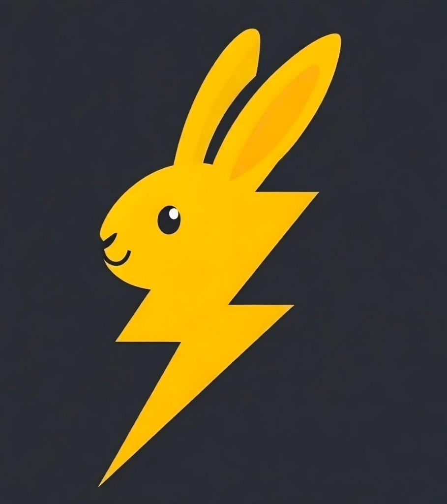

<p align="center">
  
</p>

<h1 align="center">Thunderbun</h1>

<p align="center">
  Live SDK playground for the Sui ecosystem — run in browser, ship to the Play Store.<br/>
  gRPC-first · dApp Kit · Cloudflare Workers + Agents · PWA-ready.
</p>

<p align="center">
  <a href="https://thunderbun.ai"></a>
</p>

Includes a one-click onramp flow: TradFi → Base USDC via zkp2p contracts, then a native sponsored Sui settlement PTB coordinated by WaaP + Ika-aware runtime checks.
The Sui leg resolves `zkp2p.sui` through SuiNS and enforces sponsor-address match before execution.

---

## ⚡ Quick start (local)

```bash
bun install
bun run dev
```

Opens at `http://localhost:5173`.

---

## 🔌 JSON-RPC → gRPC Migration

**JSON-RPC shuts down April 2026.** Thunderbun uses `SuiGrpcClient` from `@mysten/sui/grpc` everywhere — the migration is already done.

### What changed

| Before (JSON-RPC, deprecated) | After (gRPC, Thunderbun default) |
|-------------------------------|----------------------------------|
| `import { SuiClient } from "@mysten/sui/client"` | `import { SuiGrpcClient } from "@mysten/sui/grpc"` |
| `new SuiClient({ url: getFullnodeUrl("testnet") })` | `new SuiGrpcClient({ baseUrl: "https://fullnode.testnet.sui.io:443", network: "testnet", mvr: {} })` |
| `res.totalBalance` | `res.balance.balance` |
| `getOwnedObjects` + `showDisplay: true` | `listOwnedObjects` + `include: { json: true }` |
| `o.data?.display?.data?.name` | `o.json?.name` |
| `resolveNameServiceAddress(name)` | `SuinsClient.getNameRecord(name)` → `.targetAddress` |
| `resolveNameServiceNames(address)` | `client.defaultNameServiceName({ address })` |

### SDK compatibility

All `@mysten/*` SDKs accept `ClientWithCoreApi` — pass your `SuiGrpcClient` directly:

```ts
import { SuiGrpcClient } from "@mysten/sui/grpc";
import { SealClient } from "@mysten/seal";

const client = new SuiGrpcClient({ baseUrl: "https://fullnode.testnet.sui.io:443", network: "testnet", mvr: {} });
const seal = new SealClient({ suiClient: client, ... });
```

Works with: `dapp-kit-core`, `deepbook-v3`, `seal`, `walrus`, `suins`.

### Third-party SDKs

- **WaaP SDK** — Wallet Standard only, no client dependency. Works as-is.
- **Ika SDK** — Bundles its own `@mysten/sui@1.x`. Thunderbun isolates it via dynamic import so it never touches the main gRPC client.

---

## 📱 Ship to Google Play — Internal Testing (≈20 min)

**Internal testing** = no review, no waiting. Add your Gmail as a tester and install in seconds.

### One-time prerequisites

| Tool | Install |
|------|---------|
| [Google Play Developer account](https://play.google.com/console/signup) | $25 once |
| Java 17+ | `sudo apt install openjdk-17-jdk` / [adoptium.net](https://adoptium.net) |
| Bubblewrap | `bun run twa:setup` (or `npm install -g @bubblewrap/cli`) |

Verify everything is ready at any time:

```bash
bun run twa:prereqs
```

---

### Step 1 — Generate PNG icons

```bash
bun run icons:generate
```

This creates `public/icons/pwa-192x192.png` and `pwa-512x512.png` from the SVG.
To customise the icon, edit `public/icons/icon.svg` first.

---

### Step 2 — Configure your TWA

Edit **`twa-manifest.json`** in the project root (two fields to change):

```json
{
  "packageId": "xyz.sui.thunder",
  "host":      "thunderbun.ai"
}
```

> `host` is your domain only — no `https://`, no trailing slash.
> `packageId` must be globally unique on Play Store.

---

### Step 3 — Build and deploy to Cloudflare Workers

```bash
wrangler login              # one-time: opens browser to authenticate
bun run deploy              # builds + deploys Worker + static assets
```

The first deploy creates your Worker. Then add a custom domain (e.g. `thunderbun.ai`) in Cloudflare Dashboard → Workers & Pages → your Worker → Custom domains.

Put that domain in `twa-manifest.json` → `host`:

```json
"host": "thunderbun.ai"
```

> Update `iconUrl`, `maskableIconUrl`, and `webManifestUrl` in `twa-manifest.json` to match your domain.

---

### Step 4 — Generate signing keystore + Asset Links

```bash
bun run twa:keystore:debug
```

This:
1. Creates `android-debug.keystore`
2. Writes your SHA256 fingerprint into `public/.well-known/assetlinks.json`
3. Prints the fingerprint so you can verify

Then **redeploy** so the assetlinks file goes live:

```bash
bun run deploy
```

Verify it works: `curl https://thunderbun.ai/.well-known/assetlinks.json`

---

### Step 5 — Build the Android bundle

```bash
bun run twa:build
```

Output: `android/app/build/outputs/bundle/release/app-release.aab`

> First run: bubblewrap downloads the Android SDK (~500 MB). Grab a coffee.

---

### Step 6 — Upload to Play Console

1. [play.google.com/console](https://play.google.com/console) → **Create app**
   - App name: `Thunderbun` · Default language: English · App / Free
2. Left sidebar → **Release** → **Testing** → **Internal testing**
3. **Create new release** → Upload `app-release.aab`
4. **Testers** tab → **Create email list** → add your Gmail address
5. **Save** → **Review release** → **Start rollout to Internal testing**

---

### Step 7 — Install on your phone

1. Open Play Console → **Internal testing** → copy the **opt-in URL**
2. Open that URL on your phone → **Accept invite**
3. Install from Play Store — done

---

### Troubleshooting

| Symptom | Fix |
|---------|-----|
| App opens Chrome instead of TWA | assetlinks.json not deployed, wrong fingerprint, or `host` mismatch in `twa-manifest.json` |
| `curl /.well-known/assetlinks.json` returns 404 | Run `bun run deploy` — the `public/.well-known/` folder must be re-deployed |
| assetlinks.json served as wrong content-type | The Worker serves static assets from the Vite build — check it was deployed |
| `keytool not found` | Java not installed — see prerequisites |
| `bubblewrap: command not found` | Run `bun run twa:setup` |
| Build fails with Gradle error | Make sure Java 17 is active: `java -version` |
| Icons missing on Play Console | Re-run `bun run icons:generate` and `bun run deploy` |

---

### Upgrading the app

Bump `appVersionCode` (integer, must increase) and `appVersionName` in `twa-manifest.json`, then:

```bash
bun run deploy            # rebuild + redeploy to Workers
bun run twa:build         # new .aab
# upload new .aab to Play Console
```

---

## What's included

### SDK Integrations

| Feature | SDK | Status |
|---------|-----|--------|
| **WaaP** | `@human.tech/waap-sdk` | Embedded wallet (email/social) — prioritized, works in TWA |
| **dApp Kit** | `@mysten/dapp-kit-core` | Connect modal (WaaP + Sui Wallet, etc.) with gRPC + MVR |
| **Passkeys** | `@mysten/sui/keypairs/passkey` | WebAuthn passkeys for passwordless Sui signing, cross-subdomain |
| **Sponsored Tx** | `@mysten/sui` native | Client-side helpers + opt-in server gas station (`/api/sponsor`) |
| **SuiNS** | `@mysten/suins` | Forward lookup via SDK, reverse via gRPC `defaultNameServiceName` |
| **Walrus** | `@mysten/walrus` | SDK `readBlob()` + HTTP publisher fallback for writes |
| **DeepBook** | `@mysten/deepbook-v3` | SDK queries: `midPrice`, `getLevel2TicksFromMid`, pool params |
| **Seal** | `@mysten/seal` | Real `SealClient.encrypt()` on testnet + local AES-GCM demo |
| **Ika MPC** | `@ika.xyz/sdk` | Network status, dWallet info, dynamic import for code splitting |
| **Cross-chain Onramp** | WaaP + zkp2p SDK + zkp2p-contracts + Ika | SDK-first Base USDC onramp + sponsored Sui settlement PTB |
| **TradePort** | REST API | NFT browsing |
| **Proof Verifier** | — | Link to on-chain Groth16 / Ligetron verification |
| **x402 Scaffold** | `@x402/core` + `@x402/hono` | Paywalled endpoints ready for `@x402/sui` |
| **Hono Router** | `hono` | Worker routing (agents, /api/sponsor, /api/paid/*, static assets) |
| **PWA** | `vite-plugin-pwa` | Service worker, offline-ready, add to home screen |

### Web4 Roadmap (Batch 2)

- `@x402/sui` payment scheme — activate x402 Hono middleware when it ships
- CommerceAgent (Cloudflare Durable Object with autonomous payments)
- Agent dashboard with real-time WebSocket state

### Optional Env Overrides

```env
# Default: zkp2p.sui
VITE_ZKP2P_SUINS_NAME=zkp2p.sui

# zkp2p runtime endpoints
VITE_ZKP2P_PROVIDERS_BASE_URL=https://mobile.zkp2p.xyz/providers/
VITE_ZKP2P_CURATOR_API_URL=https://api.zkp2p.xyz
VITE_ZKP2P_ATTESTATION_SERVICE_URL=https://attestation-service.zkp2p.xyz
VITE_ZKP2P_ATTESTOR_WS_URL=wss://attestor.zkp2p.xyz/ws

# Contract routing (defaults by Sui network: mainnet->base, testnet->baseSepolia)
VITE_ZKP2P_CONTRACT_NETWORK=baseSepolia

# Onramp behavior
VITE_ZKP2P_WAIT_FOR_PROOF=true
VITE_ZKP2P_PROOF_TIMEOUT_MS=480000
VITE_ZKP2P_CONSOLE_LOGGING=false
VITE_ZKP2P_REFERRER=Thunderbun
VITE_ZKP2P_REFERRER_LOGO_URL=
VITE_ZKP2P_CALLBACK_URL=
# Optional override for providers onramp toToken
VITE_ZKP2P_ONRAMP_TO_TOKEN=8453:0x833589fCD6eDb6E08f4c7C32D4f71b54bdA02913

# Auto-trigger settlement when Base USDC balance increases
VITE_ZKP2P_AUTO_SETTLE_ON_BASE_USDC=true
# Threshold in USDC units (supports decimals)
VITE_ZKP2P_AUTO_SETTLE_MIN_USDC=1

# Default settlement amount used by Home one-tap action
VITE_ZKP2P_DEFAULT_SETTLEMENT_USD=1

# Optional explicit Sui USDC coin type for balance tracking
# If omitted, Thunderbun sums all coins ending in ::usdc::USDC
VITE_SUI_USDC_COIN_TYPE=

# Optional Move entrypoint for Sui-side settlement logic
# e.g. 0x...::zkp2p_bridge::settle_from_base_onramp
VITE_ZKP2P_SUI_SETTLEMENT_TARGET=

# Optional Move entrypoint for post-settlement DeepBook hook
# e.g. 0x...::zkp2p_bridge::deepbook_convert_usdc
VITE_ZKP2P_DEEPBOOK_HOOK_TARGET=

# Optional: enable runtime adapter lookup for Ika PR1646 helper exports
VITE_IKA_PR1646_ENABLED=false

# CCTP gas smoothing (auto dust swap USDC -> ETH on Base before burn)
VITE_CCTP_AUTO_SWAP_DUST=true
VITE_CCTP_TRY_BASE_SPONSOR=true
VITE_CCTP_DUST_SWAP_USDC=1000000
VITE_CCTP_MIN_BASE_GAS_WEI=5000000000000
VITE_CCTP_DUST_POOL_FEE=500
VITE_CCTP_DUST_MIN_OUT_WEI=0
VITE_CCTP_DUST_SWAP_ROUTER=0x2626664c2603336E57B271c5C0b26F421741e481
VITE_CCTP_BASE_WETH=0x4200000000000000000000000000000000000006
```

---

## Project layout

| Path | Purpose |
|------|---------|
| `src/dapp-kit.ts` | dApp Kit instance with gRPC transport and MVR enabled |
| `src/wallet.ts` | WaaP + dApp Kit connect modal + Wallet Standard |
| `src/sui-client.ts` | Shared SDK client accessors (Seal, DeepBook, Walrus) |
| `src/lib/zkp2p-config.ts` | zkp2p endpoint and onramp runtime config |
| `src/source-files.ts` | Raw source loader (Vite `?raw` glob for code viewer) |
| `src/components/code-viewer.ts` | Collapsible source code viewer component |
| `src/sections/` | Page sections (each is a vanilla TS render function) |
| `src/sections/passkeys.ts` | Passkey registration, auth, cross-subdomain iframe demo |
| `src/worker.ts` | Hono router — agents, gas station, x402 scaffold, static assets |
| `public/icons/` | PWA icons (replace before publish) |
| `vite.config.ts` | PWA manifest, Workbox |

---

## Deployment

### thunderbun.ai (production)

```bash
bun run build
wrangler deploy --env production   # deploys to thunderbun.ai
```

Custom domain routes (`thunderbun.ai` + `www.thunderbun.ai`) are configured in `wrangler.toml` under `[env.production]`.

### Preview / staging

```bash
wrangler deploy --env preview      # deploys to thunderbun-preview.workers.dev
```

---

## Links

- [thunderbun.ai](https://thunderbun.ai) · [WaaP](https://docs.waap.xyz) · [dApp Kit](https://sdk.mystenlabs.com/dapp-kit) · [Sui Docs](https://docs.sui.io) · [Bubblewrap](https://github.com/GoogleChromeLabs/bubblewrap) · [Play Console](https://play.google.com/console)

---

## Gas Station Setup (Optional)

The Worker includes an opt-in gas station at `POST /api/sponsor` and status endpoint `GET /api/sponsor/status`. To enable it:

```bash
# Set the sponsor private key (Bech32 suiprivkey1q... format)
wrangler secret put SPONSOR_PRIVATE_KEY

# Optionally set max gas budget in MIST (default: 50_000_000 = 0.05 SUI)
wrangler secret put MAX_GAS_BUDGET

# Optional Base gas sponsor (EVM) for bootstrap gas on Base/Base Sepolia
wrangler secret put BASE_SPONSOR_PRIVATE_KEY
# Optional vars in wrangler.toml:
# BASE_SPONSOR_RPC_URL, BASE_SPONSOR_AMOUNT_WEI, BASE_SPONSOR_COOLDOWN_MS
```

When configured, clients can send base64-encoded transaction bytes to `/api/sponsor` and receive a sponsor signature back.
For the cross-chain flow, the client sends `requiredSponsor`, and the Worker rejects signing if the configured sponsor does not match the resolved `zkp2p.sui` address.

---

## x402 Payment Scaffold

The Worker includes scaffolded routes at `/api/paid/*` with an `X-X402-Ready: scaffold` header. These endpoints are ready to be paywalled using the x402 Hono middleware once `@x402/sui` ships. The `@x402/core` and `@x402/hono` packages are already installed as dependencies.

---

MIT · [Thunderbun](https://github.com/arbuthnot-eth/thunderbun)
